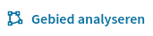

# Handleiding

Deze handleiding van DOOK is bedoeld voor medewerkers van pilotgemeenten met toegang tot de beveiligde DOOK omgeving van hun gemeente. De handleiding helpt jou op weg met het gebruik van DOOK.

DOOK is ontwikkeld om relevante (open) data beschikbaar te maken voor gemeenten. Gemeenten kunnen in DOOK een basis dataset opstellen zoals deze wordt beschreven in de 
[Handreiking Informatiebeeld Autobranche](https://kennisplatformondermijning.nl/files/view/52f04179-a7ce-438f-99e8-ef8111896e71/handreiking-informatiebeeld-autobranche.pdf) en de 
[Handreiking Informatiebeeld Bedrijventerreinen](https://kennisplatformondermijning.nl/files/view/5b06b150-56ff-4484-bfe1-0e26adff632f/handreiking-informatiebeeld-bedrijventerreinen.pdf).

→ Ga naar de [Datavoorziening Onregelmatigheden Op de Kaart](https://dook.vng.nl/)

Tip: Sla DOOK op als bookmark in jouw browser. Zo kun je in het vervolg snel naar DOOK navigeren.

→ Klik rechtsboven op **Inloggen/Registeren**

## Inloggen

Administrators ontvangen login gegevens van het DOOK team. Overige gebruikers (onderzoekers) van gemeenten krijgen een account van de eigen administrator. Heb je nog geen account? Vraag aan de administrators van jouw gemeente om toegang.

Je hebt een e-mail ontvangen met instructies om jouw account te activeren. Volg deze instructies.

→ Log in met de met de gegevens die je hebt ontvangen.

Je bent nu in de DOOK omgeving van jouw gemeente. Links in beeld zie je jouw naam en de gemeente waar je bent ingelogd.

- Ben je **administrator -** dan kun je vanuit hier naar het **administratie dashboard**.
- Ben je onderzoeker - dan kun je hier verder met het kiezen van een datarol en jouw accountinstellingen inzien en wijzigen.

## Administrator

Gemeentelijke administrators zijn verantwoordelijk voor het gebruik van DOOK binnen de gemeente en beheren de accounts van hun collega’s. Deze stap in de training is alleen bedoeld voor administrators. Je leert hier hoe je nieuwe gebruikers aanmaakt en beheert.

→ Klik in het linker menu op **Administratie dashboard**.

In het administratie dashboard heb jij als administrator een overzicht van alle DOOK gebruikers binnen de gemeente. Je kunt hier gebruikers aanmaken en beheren.

### Gebruikers aanmaken (Administrator)

→ Klik op **Nieuwe gebruiker toevoegen**.
→ Vul het formulier in. Bij **datarol** kun je meerdere rollen selecteren. Klik tot slot op **Maak gebruiker en verstuur mailbevestiging**.

Nadat deze actie is voltooid ontvangt de nieuwe gebruiker een e-mail waarmee het account geactiveerd kan worden.

**Let op:** Dit is een geautomatiseerde e-mail en deze komt soms in de **spam-box** terecht. Controleer dit als de gebruiker aangeeft geen e-mail te ontvangen.

### Gebruikers wijzigen (Administrator)

Het is mogelijk om de rechten van een gebruiker aan te passen. In het Administratiedashboard zie je bij accounts drie symbolen staan. Deze knoppen worden gebruikt om een account te wijzigen.

→ Klik op het potlood symbool om een account te wijzigen.
→ Klik op het slot symbool om een account te blokkeren of deblokkeren.
→ Klik op het kruisje om een account te verwijderen.

Als administrator ben je verantwoordelijk voor de accounts van de gemeente. Zo heeft de gemeente zelf controle wie toegang heeft tot welke kaartlagen.

## DOOK ontdekken

We gaan aan de slag met DOOK.

→ In het startscherm klik je op **Datavoorzieningen** om een keuze te maken.
→ Selecteer je gemeente.
→ Selecteer het thema **Autobranche**. De rol wordt blauw wanneer deze is geselecteerd. Klik vervolgens op de gele **Ga naar DOOK** knop.

Een data rol bepaalt tot welke thema jij toegang hebt, bijvoorbeeld ‘Autobranche’ of ‘Bedrijventerreinen’. Als onderzoeker krijg je alleen toegang tot de data rol(len) waar jij bevoegd voor bent onderzoek naar te doen.

### Thema: Autobranche

Links in beeld zie je de naam van jouw gemeente en de geselecteerde data rol.

→ Navigeer met behulp van de zoekbalk naar adres.

→ Gebruik de muis of de touchpad om de kaart te bewegen en in te zoomen. Zoom in op jouw gemeente.

Links in beeld zie je een keuzemenu met verschillende kaartlagen. Dit menu wordt gebruikt om verschillende kaartlagen zichtbaar te maken.

→ Selecteer in de lijst **Adressen en gebouwen (BAG)** de kaartlaag **Adressen**.

Je ziet op de kaart nu alle verblijfsobjecten, standplaatsen en ligplaatsen. Je kunt op een stip klikken om meer informatie te zien over het object. In het detail overzicht vind je ook een link naar de BAG viewer en naar Google streetview.

→ Probeer ook de andere kaarten van de BAG uit. Je kunt kiezen uit: **Oppervlakte verblijfsobject**, **Verblijfsobjecten met woonfunctie** en **Bouwjaar verblijfsobject**.

De verschillende kaartlagen uit de BAG helpen jou om informatie te krijgen over de omgeving. Het oppervlak van een object geeft jou een beeld of het realistisch is dat er een bepaald bedrijf actief is. De kaartlaag **Verblijfsobjecten met woonfunctie** geeft aan of je bij een controle kan verwachten dat er woningen zijn, of er alleen bedrijven gevestigd zijn. Bij een controle kan onderzocht worden of de data uit de bronnen overeenkomt met de situatie ter plekke.

→ Klik in het keuzemenu op lijst **Handelsregister.**

In deze kaartlaag kun je een of meerdere branches selecteren. Klik op het ‘>’ om de branche uit te vouwen en onderliggende SBI-codes te zien. Je kunt hiermee een zeer specifieke selectie maken.

→ Selecteer het thema **G Groot- en detailhandel; reparatie van auto’s**

DOOK filtert nu alle bedrijven die vallen onder thema G. De bijbehorende SBI’s codes (45, 46, 47) worden getoond. Het is ook mogelijk om verder te filteren door op een SBI code te klikken.

→ Filter nu specifiek op SBI code 45.

Je ziet nu waar in de gemeente zich bedrijven bevinden die ingeschreven staan onder een SBI code 45: Handel in en reparatie van auto’s, motorfietsen en aanhangers.

We gaan verder met de lijst **Informatiebeeld autobranche**.

→ Klik op **Informatiebeeld Autobranche**

→ Selecteer de kaartlaag **Ondernemingen in de autobranche (volgens SBI)**

Deze kaartlaag toont alle bedrijven binnen een gebied dat ingeschreven staan met SBI code 45 en 77. Door te klikken op een bedrijf krijg je aanvullende data te zien. Deze data zijn afkomstig uit het Handelsregister.

→ Selecteer **RDW met RDW erkenning**.

Je ziet nu alle RDW erkende bedrijven in de omgeving.

→ Klik op een bedrijf om aanvullende informatie te zien. Je ziet hier onder andere welke erkenningen het bedrijf heeft.

→ Selecteer de kaartlaag **Ondernemingen met BOVAG-lidmaatschap**.

Deze kaartlaag toont alle bedrijven met een BOVAG-lidmaatschap.

### Dataset downloaden

We gaan nu aan de slag met de kaartlaag voor het exporteren van de basis dataset. Deze kaartlaag combineert alle bronnen die we tot nu toe los van elkaar hebben bekeken.

→ Selecteer de kaartlaag **Download basisdataset ten behoeve van het informatiebeeld**.

DOOK toont nu een combinatie van alle benodigde bronnen: BAG, Handelsregister (KVK), RDW en BOVAG.

Tip: In de legenda zie de je kleuren die corresponderen met het type bron. Je kunt zo op een adres eenvoudig zien aan de kleuren welke bronnen beschikbaar zijn, en welke bronnen niet beschikbaar zijn.

Wanneer je onderzoek wilt doen naar een specifiek gebied is het mogelijk om in DOOK een gebied naar keuze te analyseren. Dit werkt als volgt:

→ Klik links in het keuzemenu op de knop **Gebied analyseren**.

→ Volg de instructies in DOOK om een gebied naar keuze te selecteren. Om de selectie compleet te maken klik je op het laatste punt dat je hebt gemaakt.

DOOK vertelt jou nu hoeveel verblijfsobjecten zich bevinden binnen dit gebied. DOOK geeft hier ook aantallen weer voor de bronnen Handelsregister (KVK), RDW en BOVAG.

→ Klik in het pop-up scherm bij download op **CSV** of **Excel** om de beschikbare gegevens van de verblijfsobjecten binnen het door jou geselecteerde gebied te downloaden in het gewenste format.

→ Klik in DOOK op **Gebied verwijderen** om de selectie ongedaan te maken.

#### Dataset onderzoeken

Laten we de geëxporteerde dataset onder de loep nemen. Het bestand dat je hebt gedownload is een CSV-bestand of een Excel bestand. Het Excel bestand is gemakkelijker te openen.

→ Open het Excel bestand en klik om **‘ctrl’ + ‘A’** om alles te selecteren. Klik nu onder **Invoegen** op **Tabel**. Het bestand is nu beter te lezen.
Je ziet nu in Excel het complete overzicht van alle objecten die jij hebt geëxporteerd en de bijbehorende gegevens uit de BAG, Handelsregister, RDW en BOVAG registraties. Dit is de basisdataset zoals deze wordt beschreven in de [Handreiking Informatiebeeld Autobranche](https://kennisplatformondermijning.nl/files/view/52f04179-a7ce-438f-99e8-ef8111896e71/handreiking-informatiebeeld-autobranche.pdf). Deze dataset kan gebruikt worden om informatie op te zoeken over bedrijven en integrale controles voor te bereiden. In de handreikingen wordt toegelicht welke indicatoren onderzocht kunnen worden aan de hand van de beschikbare data.

**Let op:** Zodra je een dataset hebt gedownload is het jouw verantwoordelijkheid om de gegevens naar de richtlijnen van de gemeente te bewaren en beheren.

### Thema: Bedrijventerreinen

In het thema **Bedrijventerreinen** is het mogelijk om het Handelsregister (KVK) in te zien voor de gehele gemeente. Het is mogelijk om specifieke branches in kaart te brengen. Bijvoorbeeld om de bedrijven op een bedrijventerrein in kaart te brengen.

→ Klik rechtsboven op **Terug naar instellingen**

→ Selecteer het thema **Bedrijventerreinen**

→ Klik op **Ga naar DOOK**

Het thema Bedrijventerreinen bestaat uit een aantal kaartlagen die deels overeenkomen met het thema Autobranche. We richten ons in deze handleiding op de kaartlaag **Informatiebeeld Bedrijventerreinen.**

→ Selecteer **Informatiebeeld Bedrijventerreinen**

In de zoekbalk kun je zoeken op een type activiteit. DOOK helpt je met het vinden van de juiste SBI-code.

→ Zoek op een bedrijfsactiviteit naar keuze, bijvoorbeeld: “Kapper”

De kappersbranche valt in dit geval onder ’**S Overige dienstverlening**’.

→ Klik op de ‘>’ om uit te vouwen totdat je de SBI-code **96021 Haarverzorging** kunt selecteren.

Op de kaart wordt getoond waar in de gemeente bedrijven onder deze SBI code staan ingeschreven. Je kunt dit op twee manieren exporteren. Je kunt klikken op **SBI-code selectie**, nu download je alle bedrijven die staan ingeschreven onder deze SBI-code. Of, je kiest voor **Gebied analyseren**, nu kun je de bedrijven uit een specifiek gebied exporteren.

## Kaartview wijzigen

Tot slot gaan we de kaart in DOOK aanpassen. Onderin beeld zie je een horizontale balk met enkele opties. Deze balk wordt gebruikt om de kaart aan te passen.

→ Klik op het schuifje bij ‘Object hoogte’ om de hoogte van objecten in de kaart zichtbaar te maken.
→ Klik op het schuifje bij ‘Luchtfoto’ om een satellietbeeld van de omgeving te creëren.

Door verder in te zoomen krijg je een goed beeld van de hoogte. Klik met je rechter muisknop op de kaart en houdt deze ingedrukt om de kaart te draaien en vanuit een andere hoek de omgeving te bekijken.

## Afronding

Wanneer je vragen hebt over het gebruik van DOOK zijn de administrators van jouw gemeente het eerste aanspreekpunt.

Mocht je technische vragen hebben over DOOK, of een fout willen melden, neem dan contact op via [dook@vng.nl](mailto:dook@vng.nl).
